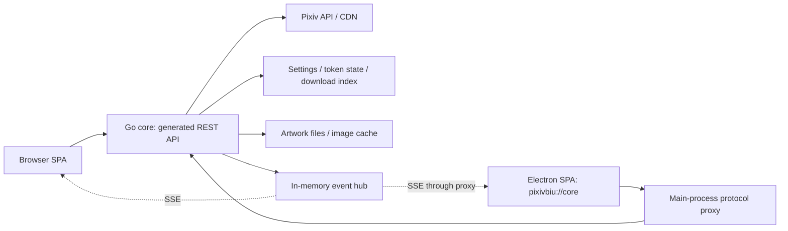

# Architecture

PixivBiu v3 has a portable Go core, an embedded React SPA, and an optional Electron shell. The core uses chi with generated OpenAPI routing and pixivgo for upstream access. Configuration and application state are local JSON files; there is no database.

For commands, see [Development](DEVELOPMENT.md). Frontend implementation patterns live in the [frontend guide](../frontend/README.md); Electron details live in the [desktop guide](../desktop/README.md).

## Runtime shapes

| Mode | UI origin | Backend | Update owner |
| --- | --- | --- | --- |
| Development | Vite, normally `http://localhost:5173` | `127.0.0.1:4001` via Vite's `/api` proxy | Developer rebuild |
| Portable executable | Core HTTP origin | Same process, default `127.0.0.1:4001` | Core self-updater on release builds |
| Docker | Published host port | Core inside the container, listening on `0.0.0.0:4001` | Operator replaces image |
| Electron | `pixivbiu://core` | Main-process proxy to a private loopback port | electron-updater |



The SPA calls `/api/v1` in every mode. Production assets come from [internal/web](../internal/web/web.go), which embeds Vite output. Hashed assets get immutable cache headers; unmatched browser routes use the SPA fallback. Unmatched `/api/v1` paths instead return a structured JSON 404. The core also registers `/docs` and `/openapi.json` in all builds.

## Modules and lifecycle

| Module | Responsibility |
| --- | --- |
| [cmd/server](../cmd/server) | Paths/flags in `main.go`; construction in `app.go`; reload hooks in `reload.go`; listener/drain in `serve.go` |
| [internal/server](../internal/server) / [internal/api](../internal/api) | HTTP middleware, generated routes, domain handlers, error projection |
| [internal/config](../internal/config) / [runtimepath](../internal/runtimepath) | Layered settings, reflected schema, atomic persistence, portable path resolution |
| [internal/pixiv](../internal/pixiv) / [auth](../internal/auth) / [state](../internal/state) | Upstream client, session lifecycle, PKCE verifiers, token store |
| [internal/download](../internal/download) | Jobs/tasks, workers, filenames, conversion and download index |
| [internal/inbox](../internal/inbox) | Ephemeral pub/sub, replay buffer and SSE |
| [internal/imgcache](../internal/imgcache) | Same-origin image proxy and on-disk cache |
| [internal/update](../internal/update) | Release discovery, checksum/signature validation and binary replacement |
| [internal/atomicfile](../internal/atomicfile) | Shared temp-file + rename writer |
| [internal/browser](../internal/browser) / [sysproxy](../internal/sysproxy) | Browser launching and OS proxy discovery |

Construction does not start background work. The entrypoint owns service starts, context cancellation, and cleanup. Shutdown closes hub subscriptions first, then drains HTTP with the configured timeout, so SSE cannot hold the drain open. Normal shutdown reports a drain error. Restart logs a timeout, force-closes HTTP, explicitly shuts down download/Pixiv services, and still re-execs. In standalone mode, Unix replaces the process image and Windows launches a successor through the platform helper. With `-desktop-managed=1`, restart returns exit code 75 only after worker cleanup and the Electron supervisor creates the successor. The private stdin pipe carries stop requests and cancels the normal lifecycle when the parent disappears; managed startup advertises `pixivbiu-desktop/1` on stdout. See the [desktop lifecycle protocol](../desktop/README.md#managed-lifecycle-protocol) for handshake, retry and shutdown deadlines.

Port fallback tries up to ten consecutive ports, bounded by 65535. Only platform-classified unavailable-port errors trigger it; Windows includes reserved ports reported as access denied. The actual bound URL is printed and used for browser auto-open. Standalone Windows startup errors pause when launched as the sole console owner so double-click failures remain visible. Managed startup never pauses and returns exit code 76 for a platform-classified port conflict, allowing the shell to retry without treating arbitrary startup failures as port races.

## HTTP contracts and trust boundary

The [OpenAPI spec](../api/openapi.yaml) owns routes, types, parameters, and response shapes. Generated methods attach to `APIHandler`; registration uses `api.HandlerWithOptions` with `/api/v1`. See the [generation workflow](DEVELOPMENT.md#openapi-workflow).

Authentication represents the core's shared Pixiv session. It is not a separate login or authorization boundary for each browser that can reach the server. The portable core binds loopback by default. A deployment exposed to other machines needs access control at its network/reverse-proxy boundary.

Open operations include health, the auth/onboarding surface, the image proxy, system version, and cached update status. Browsing, settings, downloads, events, and update check/apply require the Pixiv session. The update apply operation also requires `X-PixivBiu-App`, sent by the shared frontend API client; preserve this browser CSRF guard and the absence of cross-origin permission to send it. It is not a secret or a replacement for network access control.

Pixiv-backed pagination returns `next_offset` or `next_max_bookmark_id`; send non-null continuation values back unchanged. Null means the end. Downloads use `page`/`per_page`, newest-first ordering, a filtered total, and global active/done counts.

Bookmark/view-count search sorts sample date-ordered upstream pages and rank them locally. They are approximations, not Pixiv Premium popularity sorting or a global ranking. Window size and bounded parallelism come from `search.sample.*`.

### Errors and logs

Handlers call `WriteError`; `classify` is the central wire-error projection. Generated parameter-validation failures use the same path. Add a known sentinel for a localized error code or implement `UserError` for safe dynamic authored text. Do not construct response errors independently or copy raw upstream bodies.

| Field | Meaning |
| --- | --- |
| `code` | Stable machine token for HTTP/application failure |
| `kind` | `validation`, `app`, `upstream`, or `internal`; determines UI rendering |
| `message` | Usually empty; non-empty `app` messages are explicitly authored for display |
| `fields` | Validation map; dotted config key or parameter name, with `_` for a general error |
| `upstream` | Upstream status and stable reason (`invalid_grant`, `rate_limit`, `generic`), not the raw body |
| `request_id` | Request-log correlation; absent on frontend-synthetic errors |

The codes are `unauthenticated` (401), `bad_request` (400), `forbidden` (403), `not_found` (404), `conflict` (409), `rate_limited` (429), `upstream_error` (502), and `internal_error` (500). An expired access token alone does not require logging in again: refresh and retry can preserve the session.

Middleware order is RequestID → RealIP → httplog. httplog owns panic recovery; adding another Recoverer loses the intended structured error path. Request errors and attributes attach to the single request log via `httplog.SetError/SetAttrs`. Background events use slog. Both use ECS normalization, such as `@timestamp`, `log.level`, and `error.message`. Backend logs stay in English.

Logs normally use stdout. `log.file` redirects slog to a rotating file rather than teeing it to inherited stdout; startup validates the destination. The process also suppresses SIGPIPE termination from closed inherited output pipes. The boot banner remains on stderr in standalone mode; managed desktop mode suppresses it and captures early diagnostics through pipes. Raw diagnostics can contain private upstream/proxy details: redact them before sharing.

## Authentication and onboarding

The [state store](../internal/state/state.go) atomically persists refresh token, access token/expiry, and user identity. It requests file mode 0600 and parent mode 0700 on systems honoring Unix modes. Tokens never belong in settings or env.

The refresh token defines the session. A valid saved access token is reused at boot; missing/near-expiry credentials refresh. The background loop refreshes ahead of expiry, and authenticated `pixiv.Call/Exec` operations refresh once and retry after a 401, coordinated under the refresh lock with a same-identity client. Transient refresh errors keep the session. Permanent `invalid_grant` clears it and exposes `session_expired`; an invalid manually submitted login must not clear an existing good session.

Onboarding tests connectivity before login. Proxy detection reads OS/env candidates without network requests or persistence and strips credentials from returned addresses. A connectivity test can persist a working proxy only before authentication. `reachable:false` is a normal 200 result, not a server error.

PKCE start issues a verifier in an in-memory, single-use store (ten-minute TTL, 64-entry cap); exchange consumes it. The browser flow asks the user to capture the callback URL from DevTools Network and accepts either that URL or its code. Desktop intercepts the validated callback in its OAuth window. Both use the same code exchange and subsequent token lifecycle. Restarting the core loses pending PKCE verifiers; start a new flow if one expires or is consumed.

## Settings and paths

The Config structs define keys/types and metadata; `baseDefaults` supplies static defaults. `app.update.channel` derives its default from build maturity before Manager construction. Explicit channel overrides are retained even if they currently equal the default.

Manager validates/persists API changes and updates the effective snapshot. Services consume hot values through their live state or registered reload hooks; restart fields remain pinned. Settings are saved as overrides using atomic writes. Manual edits are not a live-reload interface. See [Configuration](CONFIGURATION.md) for masking, reset semantics, path precedence, and the complete reference.

## Downloads and recovery

The Manager exposes job operations to HTTP and publishes through an inbox interface; it does not depend on SSE. Each job contains tasks for its files. Workers use the configured concurrency and bounded exponential retry. Cancellation, local filesystem errors, and most explicit 4xx responses are non-retryable; 408/429 may retry.

The download index persists durable state at submission, completion, cancellation, and recovery boundaries. Progress ticks are ephemeral; a running transition need not be written because recovery requeues queued/running work. Files download to `<target>.<taskID>.part` before rename; failed/cancelled transfers remove partials. Recovery does not resume HTTP byte ranges. Completed files are preserved, and written intermediate ugoira payloads can be reused for interrupted conversion.

A job is the cleanup boundary. Failure or user cancellation collects only paths marked written by that job (`Task.WroteFile`); filesystem cleanup happens outside the main Manager lock. That flag is ownership bookkeeping, not protection against another process replacing the same path. History removal (`Remove` / `RemoveTerminal`, including the DELETE API) never deletes artwork files.

Collision resolution checks existing files and in-flight reservations, adding browser-style numbered suffixes and eventually a checked random suffix. Ugoira final and intermediate zip paths are reserved together. Recovery resolves collisions again for unwritten tasks and retains paths for already-written ones.

Templates are parsed at startup and on settings validation. Titles/usernames are pre-sanitized; final path segments are sanitized and byte-clamped. Explicit template separators can create directories. Output directories may be absolute, while filename templates remain relative. The data root anchors relative output. See [Path templates](CONFIGURATION.md#path-templates) for variables and examples.

Ugoira format is pinned per job: animated WebP uses pure-Go nativewebp, GIF uses the standard library with a Plan9 palette, and `none` keeps the zip. Conversion runs in the worker; errors fail the job. Format changes cannot change an already submitted job's reserved extension.

Downloads and zoom prefer per-page originals for multi-page works, or `meta_single_page.original_image_url` for single pages, with a large-image fallback.

## Events and resynchronization

`GET /api/v1/events` is one authenticated SSE stream. `?topics=download,system` filters it; omitting topics subscribes to all.

1. A reconnect sends Last-Event-ID.
2. If retained in the ring buffer, events after that ID replay before live events.
3. If the ID is unavailable, the subscriber receives `system.resync` with `{"reason":"buffer_evicted"}` and switches to live events.
4. Clients refetch authoritative REST state on reconnect/resync, including after a core restart that discarded the entire in-memory ring.

```text
id: <event-id>
event: download.task.progress
data: {"id":"<event-id>","ts":"<timestamp>","topic":"download","type":"task.progress","data":{}}
```

The frame illustrates the envelope; event-specific payloads are in OpenAPI. Treat IDs as opaque. The stream flushes frames, opts out of the normal write timeout, and sends `:keepalive` comments. Reverse proxies must preserve streaming. Task progress is throttled; terminal transitions flush final progress. Slow/disconnected clients must recover from REST rather than treating the stream as durable storage. There is no persistent unread inbox.

## Image proxy and cache

The open `GET /api/v1/proxy/img?url=...` endpoint only accepts the allowed Pixiv CDN host. Input validation and redirect validation are distinct boundaries: invalid client URLs fail with 400; cross-host upstream redirects fail with 502. Both use the allowlist in [internal/imgcache](../internal/imgcache).

Concurrent misses share a singleflight fetch. Upstream images use the configured proxy, Referer, and timeout; bodies over 64 MiB are rejected instead of cached truncated. Responses have immutable cache headers. Frontend `PximgImage` rewrites URLs and reveals decoded images over its fallback.

Cache files live at `<cacheRoot>/img`. A background sweep uses actual filesystem state, deleting oldest-by-mtime files above the configured cap. Cache hits periodically touch mtime for approximate LRU; timer and debounced write signals trigger reconciliation. The size cap hot-reloads. The cache is regenerable and does not need to be backed up with auth/settings/download history.

## Updates and distribution

The core release train embeds the SPA; the desktop train packages a core selected by `desktop/.core-version`. These versions and release repositories are independent. The core updater checks version/channel and required asset presence, then verifies the archive on apply. Trusted minisign keys are compiled into official builds. Apply is single-flight, replaces the executable, and requests restart only after the response; development versions are refused.

The desktop UI routes updates through the preload bridge and electron-updater. The shell disables the core's automatic update loop. Docker operators replace the image; the core has no dedicated container-detection no-op for apply. See the [release reference](RELEASE_REFERENCE.md#update-verification) for the trust model and the [release checklist](RELEASE.md) for publishing procedures.
